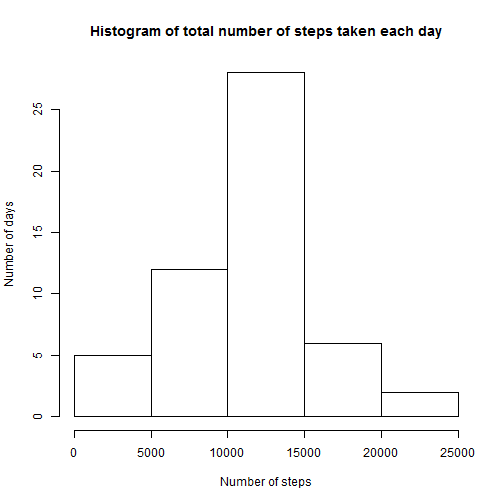
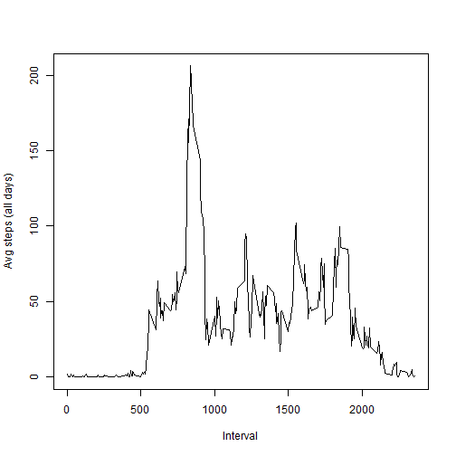

# Reproducible Research: Peer Assessment 1


## Loading and preprocessing the data

Reading in the dataset


```r
activity <- read.csv(unz("activity.zip", "activity.csv"))
```


Having a quick look at the dataset.


```r
names(activity)
```

```
## [1] "steps"    "date"     "interval"
```

```r
summary(activity)
```

```
##      steps               date          interval   
##  Min.   :  0.0   2012-10-01:  288   Min.   :   0  
##  1st Qu.:  0.0   2012-10-02:  288   1st Qu.: 589  
##  Median :  0.0   2012-10-03:  288   Median :1178  
##  Mean   : 37.4   2012-10-04:  288   Mean   :1178  
##  3rd Qu.: 12.0   2012-10-05:  288   3rd Qu.:1766  
##  Max.   :806.0   2012-10-06:  288   Max.   :2355  
##  NA's   :2304    (Other)   :15840
```


A histogram of the total number of steps taken each day.


```r
day.counts <- aggregate(steps ~ date, data = activity, FUN = sum)
hist(day.counts$steps, xlab = "Number of steps", ylab = "Number of days", main = "Histogram of total number of steps taken each day")
```

 


## What is mean total number of steps taken per day?

The mean number of steps taken each day.


```r
mean(day.counts$steps)
```

```
## [1] 10766
```


The median number of steps taken each day.


```r
median(day.counts$steps)
```

```
## [1] 10765
```


## What is the average daily activity pattern?

Time series plot of the average number of steps taken (averaged across all days) versus the 5-minute intervals


```r
mean.steps.by.interval <- aggregate(steps ~ interval, data = activity, FUN = mean)
plot(mean.steps.by.interval$interval, mean.steps.by.interval$steps, type = "l", 
    xlab = "Interval", ylab = "Avg steps (all days)")
```

 


## Imputing missing values

Calculate and report the total number of missing values in the dataset


```r
num.missing <- sum(is.na(activity))
```


Create a new dataset that is equal to the original dataset with the missing data filled in  


```r
# make a copy
activity.imputed <- activity
# set rownames to be intervals so easy to lookup
rownames(mean.steps.by.interval) <- mean.steps.by.interval$interval
# imput steps with mean steps for that interval
activity.imputed[is.na(activity.imputed), ]$steps <- mean.steps.by.interval[as.character(activity.imputed[which(is.na(activity.imputed)), 
    ]$interval), ]$steps
# check we have no na values left
sum(is.na(activity.imputed))
```

```
## [1] 0
```


Histogram of the total number of steps taken each day


```r
# sum totals for days
day.counts.imputed <- aggregate(steps ~ date, data = activity.imputed, FUN = sum)
hist(day.counts2$steps, xlab = "Number of steps", ylab = "Number of days", main = "Histogram of total number of steps taken each day")
```

```
## Error: object 'day.counts2' not found
```


Calculate and report the mean and median total number of steps taken per day.

The mean number of steps taken each day.


```r
mean(day.counts.imputed$steps)
```

```
## [1] 10766
```


The median number of steps taken each day.


```r
median(day.counts.imputed$steps)
```

```
## [1] 10766
```


Do these values differ from the estimates from the first part of the assignment?


```r
mean(day.counts.imputed$steps) - mean(day.counts$steps)
```

```
## [1] 0
```

No difference between the two mean values.


```r
median(day.counts.imputed$steps) - median(day.counts$steps)
```

```
## [1] 1.189
```


There is only a small difference between the two median values. The median value for the dataset with imputed missing data increased the median but about 1 step.

What is the impact of imputing missing data on the estimates of the total daily number of steps?


```r
sum(day.counts.imputed$steps) - sum(day.counts$steps)
```

```
## [1] 86130
```


The total daily number of steps over the days goes up by over 86000 steps with imputed missing data.


## Are there differences in activity patterns between weekdays and weekends?

Create a new factor variable in the dataset with two levels -- "weekday" and "weekend" indicating whether a given date is a weekday or a weekend day.


```r
# set date as a date type, so it can be used with weekdays function
activity.imputed$date <- as.Date(activity.imputed$date)
# initialise as everything is weekend (yeah, we wish)
activity.imputed$weekday <- "weekend"
# set Monday - Friday as weekday
activity.imputed[weekdays(activity.imputed$date) %in% c("Monday", "Tuesday", 
    "Wednesday", "Thursday", "Friday"), ]$weekday <- "weekday"
# set levels
levels(activity.imputed$weekday) <- c("weekday", "weekend")
```


Make a panel plot containing a time series plot of the 5-minute interval (x-axis) and the average number of steps taken, averaged across all weekday days or weekend days (y-axis).


```r
# weekday means
mean.steps.by.interval.weekday <- aggregate(steps ~ interval, data = activity.imputed[activity.imputed$weekday == 
    "weekday", ], FUN = mean)
mean.steps.by.interval.weekday$weekday <- "weekday"
# weekend means
mean.steps.by.interval.weekend <- aggregate(steps ~ interval, data = activity.imputed[activity.imputed$weekday == 
    "weekend", ], FUN = mean)
mean.steps.by.interval.weekend$weekday <- "weekend"
# combine by rows
mean.steps <- rbind(mean.steps.by.interval.weekday, mean.steps.by.interval.weekend)
# set levels
levels(mean.steps$weekday) <- c("weekday", "weekend")
# plot
library(lattice)
```

```
## Warning: package 'lattice' was built under R version 3.0.3
```

```r
attach(mean.steps)
xyplot(steps ~ interval | weekday, type = "l", xlab = "Interval", ylab = "Number of steps", 
    layout = c(1, 2))
```

 


From the plot we can see there are differences in activity patterns between weekdays and weekends. On average, weekdays have more activity (steps), especially in the mid-to-late morning intervals, with weekends looking like activity starts later in the day. However, weekends appear to involve higher levels of activity between mid-morning and evening time periods, with more steps on average taken compared to lower levels of activity on weekdays in the afternoon.
